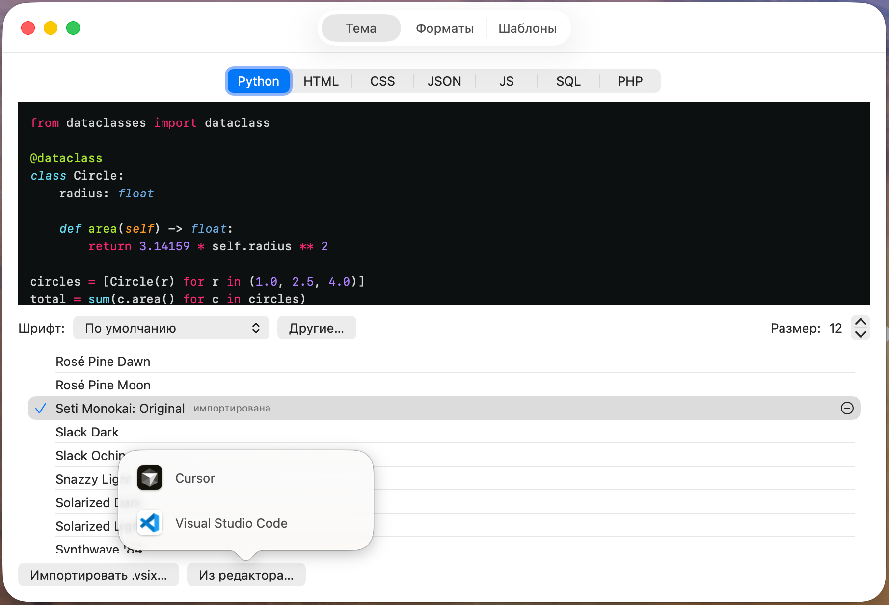

# QuickLookers

**[Русский](#русский)** · **[English](#english)**

## QuickLook программного кода в вашем рабочем стиле.

- Просмотр программного кода по пробелу в Finder на macOS **в той же теме, что у вашего VS Code-based редактора кода** (Cursor, Windsurf, Antigravity, etc.).
- Используется тот же самый движок подсветки ([Shiki](https://shiki.style)), те же грамматики и темы, что и в VS Code.
- Можно импортировать свои темы и грамматики из `.vsix` файлов, а также дефолтные темы и шрифты изо всех VS Code-based редакторов кода, установленных на вашем компьютере. Поддерживаются устаревшие грамматики tmLanguage.
- Можно настроить сопоставление «расширение файла → язык» с помощью glob-масок.
- Оптимизирован для производительности и энергопотребления (см. далее).

<!-- Скриншоты / Screenshots
     TODO: положить картинки в docs/screenshots/ и раскомментировать:
     
     
-->

> 🖼️ **Скриншоты будут здесь.** _Screenshots go here._

---

## Русский

### Что это

macOS-приложение, возвращающее полноразмерное превью кода по пробелу в Finder — взамен сломавшихся старых плагинов QuickLook (`.qlgenerator`). Главная цель — отображать код **визуально один-в-один как вам привычно при вашей работе в VS Code / Cursor / etc.**: подсветка построена на настоящих TextMate-грамматиках и темах VS Code через движок [Shiki](https://shiki.style) в JavaScriptCore, а не на самописных приближениях.

В планах была поддержка Markdown, но в процессе подготовки проекта был обнаружен более подходящий проект — [FluxMarkdown](https://github.com/xykong/flux-markdown). Рекомендую пользоваться им для просмотра Markdown-кода.

Что поддерживается сейчас:

- **218 языков** и **54 темы** «из коробки» (входят в состав Shiki).
- Импорт своих тем и грамматик из загруженных `.vsix`, а также темы и шрифта прямо из установленного VS Code / Cursor / etc. - включая устаревшие грамматики tmLanguage.
- Настройка сопоставления «расширение файла → грамматика подсветки» с помощью glob-масок *(ограничено возможностями macOS — невозможно просто прописать любую маску, только для предустановленных расширений, если вам не хватает какого-то расширения — напишите в issues)*.

### Состояние

Проект в стадии пользовательского тестирования.

У меня нет возможности оплачивать Developers's Account, поэтому сборки **не нотаризованы**. Если хотите поддержать проект — вы можете оплатить мне акаунт разработчика.

| Подсистема | Статус |
|---|---|
| Движок рендеринга (`QuickLookersEngine`) | вся библиотека Shiki (218 языков, 54 темы), встроенные грамматики |
| Расширение QuickLook Preview | перехват языков по проверенным UTI, тема из настроек; перенос строк, обрезка длинных строк, тёплый WebView, кэш HTML |
| Главное приложение + настройки + App Group | три вкладки (Темы / Форматы / Просмотр в Finder), импорт из редактора и `.vsix` |

### Оптимизация производительности и энергопотребления

- **Главное приложение** — настройки, импорт тем/грамматик из VS Code / Cursor и `.vsix`, управление кэшем. Менеджер библиотеки.
- **Расширение QuickLook Preview** — в песочнице, только рисует готовое.
- **Общий контейнер (App Group)** — темы, грамматики, кэш HTML, настройки.

Подсветка: `код + язык + тема → HTML` через Shiki в JavaScriptCore, затем статичный показ в `WKWebView` с выключенным JavaScript.

### Требования для самостоятельной сборки

- **macOS 13** или новее.
- **Swift 6 / Xcode 26**.
- **[XcodeGen](https://github.com/yonaskolb/XcodeGen)**: `brew install xcodegen`.
- **Apple ID** для подписи (достаточно бесплатного — см. ниже про ограничения).

> Node.js нужен **только** для пересборки JS-бандла Shiki. Готовый бандл уже в ресурсах и коммитится, поэтому для обычной сборки Node не требуется.

### Сборка и запуск из исходников

**Шаг 1. Сгенерировать проект Xcode (обязательно, на старте).**

```bash
xcodegen generate
```

`QuickLookers.xcodeproj` **намеренно не хранится в репозитории** (он в `.gitignore` как артефакт XcodeGen). Пока не выполнишь эту команду — открывать в Xcode будет нечего, пока проект не сгенерирован.

**Шаг 2. Подставить свой Team ID.**

В проекте зашит Team ID автора (`5FVC5YT2B5`). Замените его на **свой** (Xcode → Settings → Accounts → ваш аккаунт → Team ID) в четырёх местах:

- `project.yml` — `DEVELOPMENT_TEAM`;
- `project.yml` — `com.apple.security.application-groups` у **хоста**;
- `project.yml` — `com.apple.security.application-groups` у **расширения**;
- `Sources/QuickLookersSettingsKit/SettingsStore.swift` — `quickLookersAppGroupId`.

Префикс App Group **обязан** совпадать с твоим Team ID — иначе сборка не подпишется. После правки `project.yml` перегенерируй проект (`xcodegen generate`), чтобы новые значения попали в проект.

**Шаг 3. Собрать и запустить из Xcode.**

Откройте `QuickLookers.xcodeproj`, выберите схему **QuickLookers** и нажмите **⌘R**.

> ⚠️ **Важно:** превью в Finder надёжно регистрируется в системе **только запуском хоста из Xcode (⌘R)**. Двойной клик по собранному `.app`, `lsregister` или `pluginkit` для регистрации расширения QuickLook **недостаточны**. Это ограничение самой macOS, а не проекта.

**Тесты пакета** (чистая логика, без Xcode):

```bash
swift test
```

### Ограничения распространения (важно)

У автора **нет платного аккаунта Apple Developer**, поэтому сборки **не нотаризованы**:

Готовый скачанный бинарник Gatekeeper по умолчанию заблокирует («не удаётся проверить разработчика»). Поэтому либо соберите приложение сами по инструкции выше, либо разблокируйте скачанный бинарник — как это сделать, смотрите ниже «Запуск ненотаризованного приложения».

### Запуск ненотаризованного приложения

Так как сборки **не нотаризованы**, при первом запуске macOS покажет «Приложение повреждено» («App is damaged») или «Не удаётся проверить разработчика» («Unidentified developer»). Это ожидаемо. Разблокировать можно одним из двух способов.

**Способ 1 — командная строка (проще и надёжнее).** Снимите с бандла атрибуты карантина:

```bash
xattr -cr "/Applications/QuickLookers.app"
```

(поправьте путь, если приложение лежит не в `/Applications/`). После этого приложение запускается как обычно. Более точечный вариант — снять только карантин: `xattr -dr com.apple.quarantine "/Applications/QuickLookers.app"`.

**Способ 2 — через интерфейс (GUI).** Попробуйте открыть приложение двойным кликом → появится предупреждение → откройте **Системные настройки → Конфиденциальность и безопасность**, пролистайте вниз и нажмите **«Всё равно открыть»**, затем подтвердите. Разрешение нужно дать один раз.

> На macOS Sequoia и новее прежний обход «правый клик → Открыть» больше не работает — только через «Всё равно открыть» в настройках.

### Возможные проблемы и их решения

- **«App is damaged» / «Unidentified developer».** Снимите карантин: `xattr -cr "/Applications/QuickLookers.app"`.
- **QuickLook не показывает обновления.** Сбросьте кэш QuickLook: `qlmanage -r`.
- **Превью не работает вообще:**
  - убедитесь, что приложение лежит в `/Applications/`;
  - перезапустите Finder: `killall Finder`;
  - проверьте активные расширения QuickLook: `pluginkit -m -v`;
  - если превью так и не появилось — самый надёжный путь его запустить: собрать и один раз запустить приложение из Xcode (**⌘R**, см. выше). macOS не грузит ненотаризованный плагин из карантина, пока его явно не разрешат.

### Лицензия

**GPL-3.0** — см. [`LICENSE`](LICENSE). Коротко: бери и меняй свободно, но любой производный продукт обязан **сохранять авторство** и **оставаться открытым** под той же GPL-3.0.

Встроенные сторонние компоненты (Shiki, грамматики, темы, датасет linguist) — под своими лицензиями, см. [`THIRD-PARTY-NOTICES.md`](THIRD-PARTY-NOTICES.md).

---

## English

### What it is

A macOS app that brings back full-size code preview on Space in Finder — replacing the broken legacy `.qlgenerator` QuickLook plugins. The goal is to render code **exactly the way you're used to in VS Code / Cursor / etc.**: highlighting is built on real TextMate grammars and VS Code themes via the [Shiki](https://shiki.style) engine running in JavaScriptCore, not on hand-rolled approximations.

Markdown support was planned, but during development a more suitable project turned up — [FluxMarkdown](https://github.com/xykong/flux-markdown). Use it for previewing Markdown.

What's supported today:

- **218 languages** and **54 themes** out of the box (bundled with Shiki).
- Import your own themes and grammars from downloaded `.vsix`, plus the theme and font straight from an installed VS Code / Cursor / etc. — including legacy tmLanguage grammars.
- Configurable "file extension → highlighting grammar" mapping via glob patterns *(limited by macOS — you can't just declare an arbitrary pattern, only preset extensions; if you're missing one, open an issue)*.

### Status

The project is at the user-testing stage.

I can't afford a paid Developer Account, so builds are **not notarized**. If you'd like to support the project, you're welcome to fund a developer account for me.

| Subsystem | Status |
|---|---|
| Rendering engine (`QuickLookersEngine`) | the full Shiki library (218 languages, 54 themes), embedded grammars |
| QuickLook Preview extension | language interception via verified UTIs, theme from settings; line wrap, long-line truncation, warm WebView, HTML cache |
| Main app + settings + App Group | three tabs (Themes / Formats / Finder preview), import from editor and `.vsix` |

### Performance and energy optimization

- **Main app** — settings, theme/grammar import from VS Code / Cursor and `.vsix`, cache
  management. The library manager.
- **QuickLook Preview extension** — sandboxed, only renders the prepared output.
- **Shared container (App Group)** — themes, grammars, HTML cache, settings.

Highlighting: `code + language + theme → HTML` via Shiki in JavaScriptCore, then a static render in `WKWebView` with JavaScript disabled.

### Requirements for building yourself

- **macOS 13** or newer.
- **Swift 6 / Xcode 26**.
- **[XcodeGen](https://github.com/yonaskolb/XcodeGen)**: `brew install xcodegen`.
- An **Apple ID** for signing (a free one is enough — see the distribution limits below).

> Node.js is needed **only** to rebuild the Shiki JS bundle. The prebuilt bundle is already in the resources and committed, so a normal build does not require Node.

### Build & run from source

**Step 1. Generate the Xcode project (mandatory, first thing).**

```bash
xcodegen generate
```

`QuickLookers.xcodeproj` is **deliberately not stored in the repo** (it is `.gitignore`d as an XcodeGen artifact). Until you run this command, there is nothing to open in Xcode.

**Step 2. Set your own Team ID.**

The author's Team ID (`5FVC5YT2B5`) is baked into the project. Replace it with **yours** (Xcode → Settings → Accounts → your account → Team ID) in four places:

- `project.yml` — `DEVELOPMENT_TEAM`;
- `project.yml` — `com.apple.security.application-groups` for the **host**;
- `project.yml` — `com.apple.security.application-groups` for the **extension**;
- `Sources/QuickLookersSettingsKit/SettingsStore.swift` — `quickLookersAppGroupId`.

The App Group prefix **must** match your Team ID, otherwise the build won't sign. After editing `project.yml`, regenerate the project (`xcodegen generate`) so the new values land in it.

**Step 3. Build & run from Xcode.**

Open `QuickLookers.xcodeproj`, select the **QuickLookers** scheme and press **⌘R**.

> ⚠️ **Important:** the Finder preview reliably registers with the system **only when the host is run from Xcode (⌘R)**. A double-click on the built `.app`, `lsregister`, or `pluginkit` are **not enough** to register the QuickLook extension. This is a macOS limitation, not the project's.

**Package tests** (pure logic, no Xcode):

```bash
swift test
```

### Distribution limits (important)

The author has **no paid Apple Developer account**, so builds are **not notarized**.

A prebuilt downloaded binary is blocked by Gatekeeper by default ("cannot verify the developer"). So either build the app yourself following the steps above, or unblock the downloaded binary — see "Running the non-notarized app" below.

### Running the non-notarized app

Because builds are **not notarized**, on first launch macOS shows "App is damaged" or "Unidentified developer". This is expected. Unblock it in one of two ways.

**Way 1 — command line (simplest and most reliable).** Strip the quarantine attributes from the bundle:

```bash
xattr -cr "/Applications/QuickLookers.app"
```

(fix the path if the app lives outside `/Applications/`). After that the app launches normally. A more surgical variant is to remove only the quarantine flag: `xattr -dr com.apple.quarantine "/Applications/QuickLookers.app"`.

**Way 2 — GUI.** Try to open the app by double-clicking → you get a warning → open **System Settings → Privacy & Security**, scroll down and click **"Open Anyway"**, then confirm. You only need to allow it once.

> On macOS Sequoia and later the old "right-click → Open" bypass no longer works — only "Open Anyway" in Settings.

### Troubleshooting

- **"App is damaged" / "Unidentified developer".** Clear quarantine: `xattr -cr "/Applications/QuickLookers.app"`.
- **QuickLook not showing updates.** Reset the QuickLook cache: `qlmanage -r`.
- **Preview not working at all:**
  - make sure the app is in `/Applications/`;
  - restart Finder: `killall Finder`;
  - check active QuickLook extensions: `pluginkit -m -v`;
  - if the preview still doesn't show up — the most reliable way to get it running is to build and launch the app once from Xcode (**⌘R**, see above). macOS won't load a non-notarized, quarantined plug-in until it's explicitly allowed.

### License

**GPL-3.0** — see [`LICENSE`](LICENSE). In short: use and modify freely, but any derivative product must **keep attribution** and **stay open source** under the same GPL-3.0.

Bundled third-party components (Shiki, grammars, themes, the linguist dataset) are under their own licenses, see [`THIRD-PARTY-NOTICES.md`](THIRD-PARTY-NOTICES.md).

---

## 简体中文（概要）

QuickLookers 是一款 macOS 应用：在 Finder 中按空格键即可预览源代码，**外观与 VS Code / Cursor 完全一致**——使用与 VS Code 相同的高亮引擎（[Shiki](https://shiki.style)）、相同的语法与主题。

- 开箱即用，支持 **218 种语言**和 **54 种主题**。
- 可从下载的 `.vsix` 导入自定义主题与语法，也可直接从已安装的 VS Code / Cursor 等编辑器导入主题与字体（支持旧版 tmLanguage 语法）。
- 可用 glob 通配符配置「文件扩展名 → 高亮语法」的映射。
- 针对性能与能耗进行了优化。

Markdown 不在本项目范围内 —— 推荐使用 [FluxMarkdown](https://github.com/xykong/flux-markdown)。

> 由于作者没有付费的 Apple Developer 账号，构建版本**未经过公证（notarization）**。首次打开若提示「已损坏」或「无法验证开发者」，请在终端运行 `xattr -cr "/Applications/QuickLookers.app"` 解除限制，或按上文从源码自行构建。

授权协议：**GPL-3.0**（见 [`LICENSE`](LICENSE)）。
